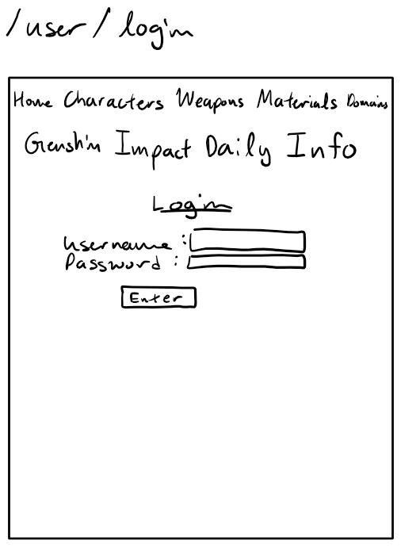
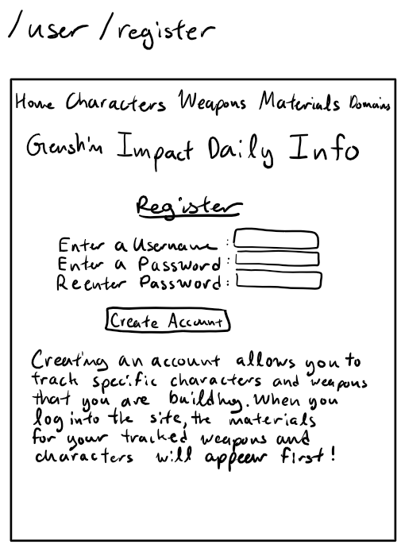

<!--  -->
# Genshin Impact Daily Info

## Overview

In the game Genshin Impact, there are available areas in the game that are only available on certain days. Checking for which of these areas are available on what days can get tedious, as every character and weapon need different materials, and you may end up forgetting what each one needs. The goal of this site is to eliminate the need to memorize what days and what materials are needed for you to level up your characters and weapons.

Genshin Impact Daily Info is a web app that will allow users to view what materials are available on the day the user accesses the site. Users must register an account, and then can indicate which characters and weapons they want to focus on, so those will appear clearly on the page.

## Data Model

The application will store Users, Characters, Weapons, Materials, Domains, Polls, and PollAnswers

* users can have multiple characters, weapons, and poll answers (via references)
* characters and weapons contain materials (via references)
* materials contain domains (via references)
* polls contain poll answers (via references)
* poll answers contain the poll to which they are answers to and the users that answered them (via references)

An Example User:

```javascript
{
  username: // username
  salt: // password salt
  hash: // password hash
  characters: // an array of references to documents containing the character info
  weapons: // an array of references to documents containing the weapon info
  pollAnswers: // an array of references to documents containing the user's poll answers
}
```

An Example Character document:

```javascript
{
  name: "Beidou",
  region: "Liyue",
  vision: "Electro",
  talent_material: ObjectId('...'), // object ID of talent material
  weekly_material: ObjectId('...')  // object ID of weekly material
}
```

An Example Weapon document:

```javascript
{
  name: "Sacrificial Greatsword",
  class: "Claymore",
  rarity: 4,
  ascension_material : ObjectId('...') // object ID of ascension_material
}
```

An Example Material document:

```javascript
{
  name: "Boreal Wolf Teeth",
  days_of_week: "Tuesday Friday",
  domain: ObjectId('...') // object ID of domain
}
```

An Example Domain document:

```javascript
{
  name: "Stormterror's Lair"
  region: "Mondstadt", 
  weekly_boss: "Dvalin",
  type: "Trounce"
}
```


## [Link to Commented First Draft Schema](src/models/user_model.js) 

## Wireframes

/user/login - login page



/user/register - registration page



## Site map


## User Stories or Use Cases

1. as a non-registered user, I can register a new account with the site
2. as a non-registered user, I can view the about tab, which informs me on how the website works
3. as a registered user, I can log in to the site
4. as a registered user, I can mark characters and weapons to track, so that they show up first on the home page
5. as a registered user, I can view all of my tracked characters and weapons
6. as a registered user, I can add and remove weapons and characters to be tracked
7. as a registered user, I can submit an answer to the weekly poll

## Research Topics

* (5 points) Integrate user authentication
    * I'm going to be using `passport.js` for user authentication
    * It allows me to easily implement user login and logout, which is essential for the site
* (2 points) Countdown timers
    * I will use date-fns to get time values to create the countdown timers shown on the home page
    * It will automatically handle time zone differences
* (2 points) Flexbox
    * I am aiming to use flexbox to style my pages
    * Flexbox is more flexible than native css stylings
* (3 points) MongoDB + Heroku Deployment
    * I am using these to make my web app available outside of the class

12 points total out of 8 required points


## [Link to Initial Main Project File](src/app.js) 

## Annotations / References Used

1. [passport.js](https://github.com/nyu-csci-ua-0467-001-002-spring-2022/final-project-danilo-montes/tree/7230f041144c1ad6c4bbb0781ea62b11124e3168) - I based my login on the one used in the initial commit of the repository (sample list site)
2. [date-fns](https://date-fns.org/)
3. [flexbox](https://css-tricks.com/snippets/css/a-guide-to-flexbox/) - [used in css file](/public/stylesheets/style.css)
4. [MongoBD + Heroku Deployment](https://www.mongodb.com/developer/how-to/use-atlas-on-heroku/)
