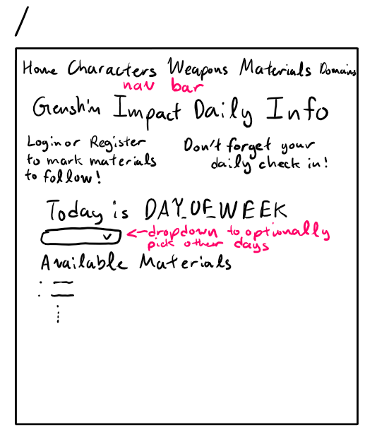
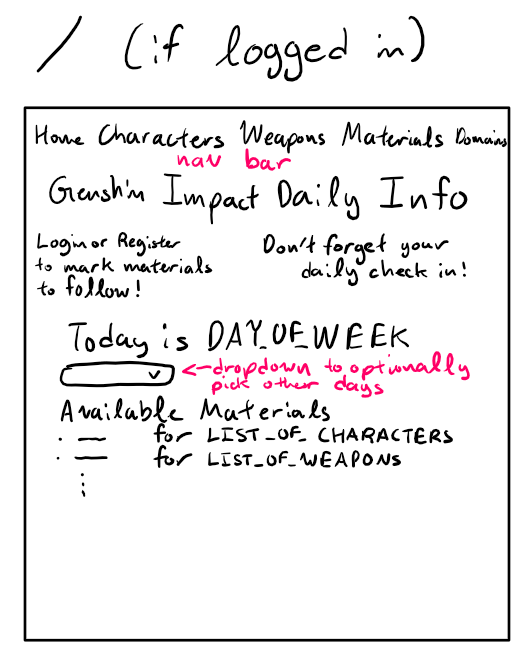
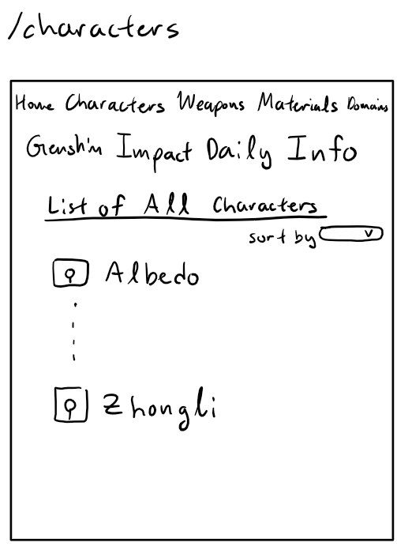
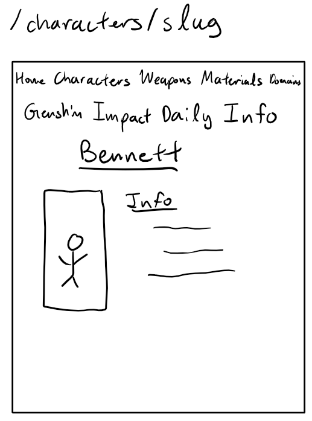
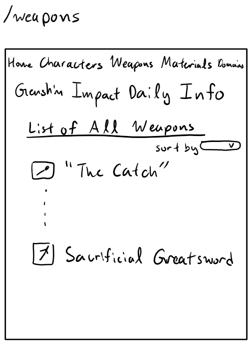
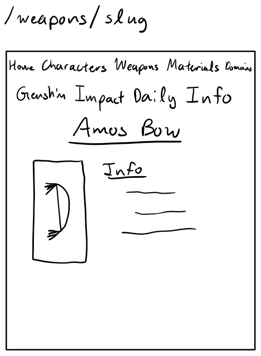
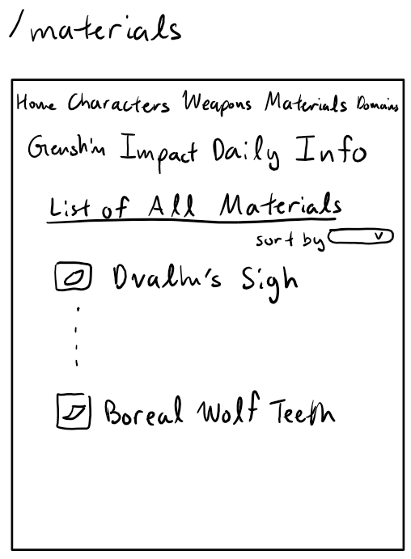
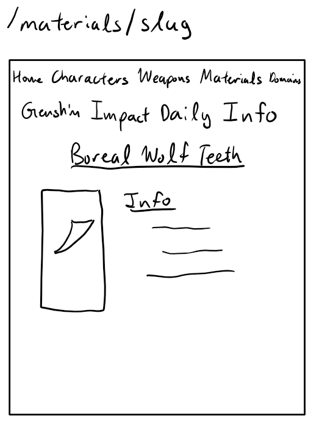
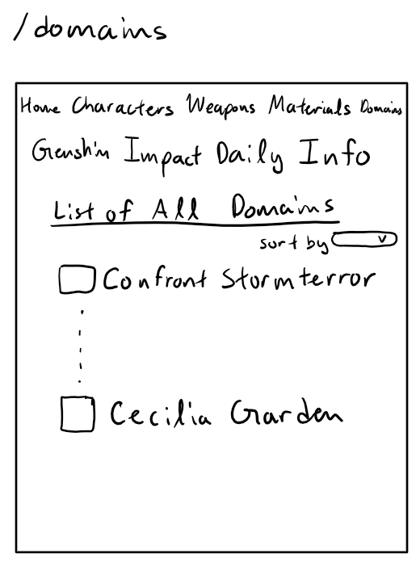
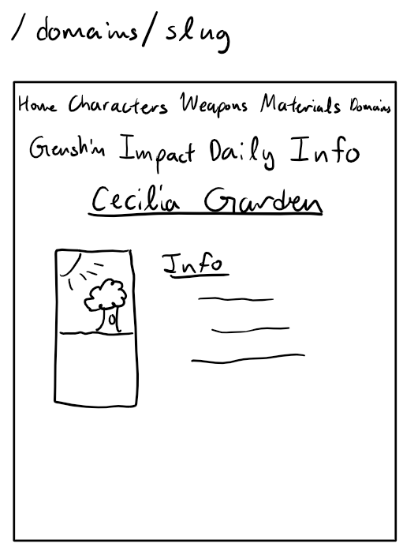

<!--  -->
<!-- 
git add .
git commit -m <message>

GitHub
git push

Heroku
git push heroku master
-->
# Genshin Impact Daily Info

## Overview

In the game Genshin Impact, there are available areas in the game that are only available on certain days. Checking for which of these areas are available on what days can get tedious, as every character and weapon need different materials, and you may end up forgetting what each one needs. The goal of this site is to eliminate the need to memorize what days and what materials are needed for you to level up your characters and weapons.

Genshin Impact Daily Info is a web app that will allow users to view what materials are available on a given day (the current day, by default). Registered users can also indicate which characters and weapons they want to focus on, so those will appear clearly on the page.

## Data Model

The application will store Users, Characters, Weapons, Materials, and Domains

* each list will store information about a single character or weapon
* users can have multiple characters and weapons (via references)
* characters and weapons contain materials (via references)
* materials contain domains (via references)

An Example User:

```javascript
{
  username: // username
  password: // hashed password
  lastVisited: // time when the user last visited the site
  characters: // an array of references to documents containing the character info
  weapons: // an array of references to documents containing the weapon info
}
```

An Example Character document:

```javascript
{
  name: "Beidou",
  region: "Liyue",
  vision: "Electro",
  talent-material: "Gold",
  weekly-material: "Dvalin's Sigh"
}
```

An Example Weapon document:

```javascript
{
  name: "Sacrificial Greatsword",
  class: "Claymore",
  rarity: 4,
  stats: {base_atk: "565", 
          second_stat: "Energy Recharge", 
          second_stat_number: "30.6%"},
  ascension_material : "Boreal Wolf Teeth"
}
```

An Example Material document:

```javascript
{
  name: "Boreal Wolf Teeth",
  days_of_week: "Tu/Fr",
  domain: "Cecilia Garden"
}
```

An Example Domain document:

```javascript
{
  name: "Stormterror's Lair"
  region: "Mondstadt", 
  weekly_boss: "Dvalin"
}
```


## [Link to Commented First Draft Schema](db.js) 

## Wireframes

/ - home page of site



/ - home page of site if user is logged in



/user/login - login page


/user/register - registration page


/characters - list of all characters



/characters/slug - information about a specific character



/weapons - list of all weapons



/weapons/slug - information about a specific weapon



/materials - list of all materials



/materials/slug - information about a specific material



/domains - list of all domains



/domains/slug - information about a specific domain



## Site map


## User Stories or Use Cases

1. as a non-registered user, I can register a new account with the site
2. as a non-registered user, I can view the available talent and weapon level up material for any given day
3. as a non-registered user, I can look up general information about characters, weapons, materials, and domains
4. as a user, I can log in to the site
5. as a user, I can mark characters and weapons to track, so that they show up first on the home page
6. as a user, I can view all of my tracked characters and weapons
7. as a user, I can add and remove weapons and characters to be tracked

## Research Topics

* (5 points) Integrate user authentication
    * I'm going to be using `passport.js` for user authentication
    * `passport` seems to be a relatively simple to use library, and should allow me to implement user authentication without too much trouble
* (2 point) Countdown timers
    * I will use data-fns to get time values to 
    * It will automatically handle time zone differences
    * Might be something already native to js
* (2 points) Flexbox
    * I am aiming to use flexbox to style my pages
    * Flexbox is more flexible than native css stylings
* (3 points) MongoDB + Heroku Deployment
    * I am using these to make my web app available outside of the class

11 points total out of 8 required points


## [Link to Initial Main Project File](app.js) 

## Annotations / References Used

1. [passport.js sign in tutorial](https://medium.com/swlh/set-up-an-express-js-app-with-passport-js-and-mongodb-for-password-authentication-6ea05d95335c) - still working on implementation
2. [flexbox](https://css-tricks.com/snippets/css/a-guide-to-flexbox/) - [used in css file](/public/stylesheets/style.css)